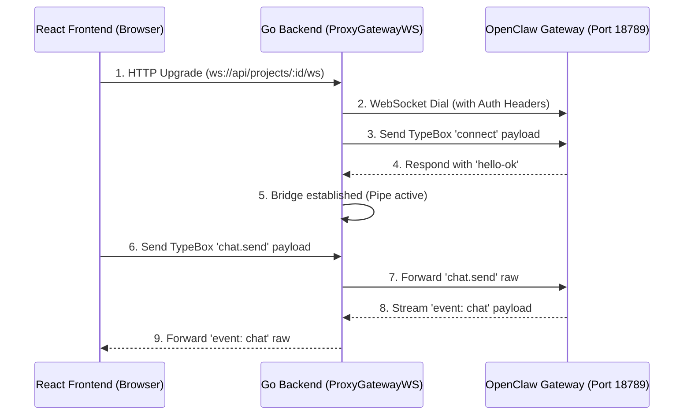

# OpenClaw WebSocket Chat Protocol Architecture

This document provides a comprehensive, end-to-end guide on how the AIAGENZ platform communicates with OpenClaw Agent containers via WebSockets. It details the strict protocol requirements, the architecture of the Go backend proxy, and the React frontend's message handling. 

This guide is highly recommended reading for any developer or AI Agent working on or modifying the chat system.

---

## 1. What is the OpenClaw Gateway?

OpenClaw runs a dedicated **Gateway WebSocket Server** (usually on port `18789`). This Gateway acts as the central Nervous System for the agent. It strictly controls all incoming connections, capabilities, and messages routed to the Agent's core models.

The Gateway does **NOT** use standard HTTP REST endpoints for realtime chat. Instead, it maintains a persistent WebSocket connection that serves as both a Control Plane (for executing commands/tools) and a Data Plane (for streaming chat text).

## 2. What is TypeBox and Why Does it Reject Connections?

The most critical aspect of the OpenClaw Gateway is its **TypeBox Protocol Validation Engine**.

*   **TypeBox** is a strict TypeScript schema validator (using AJV under the hood).
*   OpenClaw uses TypeBox to strictly enforce the exact structure, data types, and permitted properties of *every single JSON frame* sent over the WebSocket.
*   **Zero Tolerance:** If you send an unrecognized property (e.g., `jsonrpc: "2.0"`), an incorrect enumeration (e.g., `platform: "go"` instead of `node`), or miss a required required parameter (e.g., omitting `scopes`), the Gateway will violently and instantly sever the WebSocket pipe.
*   **The Infamous Error 1008 / 1006:** When the Gateway closes the connection with HTTP Code `1008 (Policy Violation)` or your browser reports `1006 (Abnormal Closure)`, it is almost always because the JSON payload you sent failed TypeBox validation, *not* because of CORS or HTTP headers.

### Allowed Frame Types
TypeBox only recognizes three root-level payload types:
1.  `req`: A request from the client (e.g., `connect`, `chat.send`).
2.  `res`: A response from the server acknowledging a request.
3.  `event`: A server-sent push notification (e.g., streamed `chat` tokens, `tick` heartbeats).

---

## 3. Architecture Overview: The Proxy Tunnel

Because the OpenClaw container is typically isolated on a private Docker network (e.g., `172.x.x.x`) and requires sensitive authentication tokens, the browser cannot connect to it directly. 

We use a **Backend Proxy Architecture**:



---

## 4. The Handshake: `ProxyGatewayWS` (Go Backend)

The Go backend (`backend-go/internal/service/project.go`) acts as the secure bridge. When the frontend connects, Go performs the most critical step: **The Authenticated TypeBox Handshake**.

### The `connect` Frame
The Gateway expects the *very first message* on the WebSocket to be a `req:connect` JSON object. If the Go proxy waits (e.g., trying a Challenge-Response loop) or sends a different format, it gets kicked with 1008.

**Required Schema for Authenticated Connections:**
```json
{
  "type": "req",
  "id": "init-1",
  "method": "connect",
  "params": {
    "minProtocol": 3,
    "maxProtocol": 3,
    "client": {
      "id": "cli",
      "displayName": "Backend Proxy",
      "version": "1.0.0",
      "platform": "node",
      "mode": "cli"
    },
    "role": "operator",
    "scopes": ["operator.read", "operator.write"],
    "auth": {
      "token": "<YOUR_SECRET_GATEWAY_TOKEN>"
    }
  }
}
```

### Key Requirements in this Frame:
1.  **Strict Enums (`client`)**: The `platform` must be recognized (e.g., `node`, `macos`), and `id`/`mode` must be valid (e.g., `cli`). Sending custom strings like "go" or "backend" will fail AJV validation.
2.  **Explicit Scopes (`scopes`)**: You must explicitly request `["operator.read", "operator.write"]`. If you omit `operator.write`, the connection succeeds, but later attempts to send chat messages will fail with `Error: missing scope: operator.write`.
3.  **Token Injection (`auth`)**: While HTTP Headers (`Sec-WebSocket-Protocol`, `Authorization`) help route the connection, the OpenClaw protocol *requires* the token to be explicitly provided inside the `params.auth.token` field of this initial JSON frame.
4.  **No Extraneous Data**: Do not include legacy JSON-RPC payloads or hidden prompt injections immediately after connecting. Just open the pipe and wait for the frontend.

---

## 5. The Application Layer: `AgentChatPanel.tsx` (React Frontend)

Once Go establishes the tunnel, the React frontend is responsible for constructing valid TypeBox messages and sending them blindly through the proxy.

### A. Sending a Chat Message
Instead of a simple string or JSON-RPC, the frontend must format user input into a `chat.send` request.

**Frontend Payload (`req: chat.send`):**
```ts
const frameId = Date.now().toString(); // Must be unique per request
const payload = {
    type: "req",
    id: frameId,
    method: "chat.send",
    params: {
        message: "Hello OpenClaw!",
        idempotencyKey: frameId // CRITICAL: Required for side-effect methods
    }
}
ws.send(JSON.stringify(payload));
```

### B. Receiving Chat Responses
OpenClaw streams its replies defensively. It does not return the chat text inside a `res` frame. Instead, it streams Server-Sent Events (`type: event`).

**Frontend Parser (`ws.onmessage`):**
```ts
const handleWsMessage = (data: any) => {
    // 1. Listen for streamed chat content
    if (data.type === 'event' && data.event === 'chat') {
        const content = data.payload?.message || data.payload?.text || '';
        // Render content to UI
    }

    // 2. Listen for agent typing/thinking activity
    if (data.type === 'event' && (data.event === 'presence' || data.event === 'agent')) {
        setIsTyping(true);
    }

    // 3. Listen for Schema Rejections / Errors
    if (data.type === 'res' && !data.ok && data.error) {
        console.error("OpenClaw rejected the action:", data.error.message);
    }
}
```

## Summary Checklist for Troubleshooting 1008/1006 Core Dumps
If you modify this system in the future and connections start dying instantly, check these:
- [ ] Did you change a property name in the JSON payload? (TypeBox will reject it).
- [ ] Is the Go proxy trying to intercept or inject messages that aren't strict `req/res/event` objects?
- [ ] Did you remember to request `operator.write` in the Go Handshake?
- [ ] Is the frontend remembering to send an `idempotencyKey` with state-changing requests like `chat.send` or `agent` methods?
